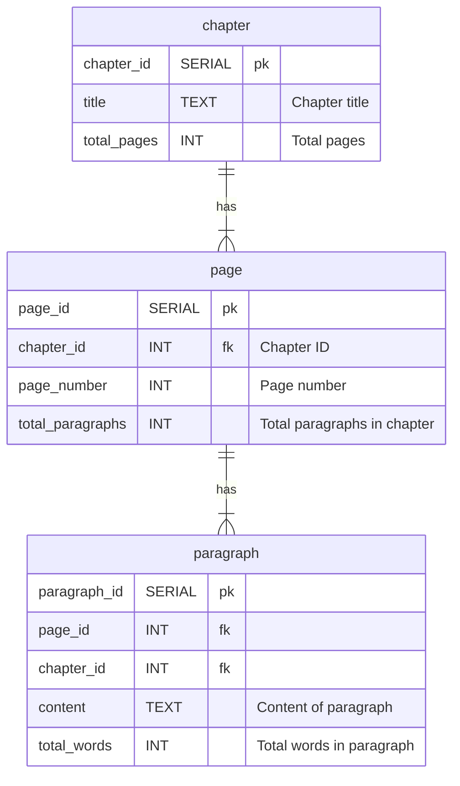

# SQC-Project
Beizeng Vue
-----------

2-5. Checkpoint: A basic web server assignment

[Project link](https://beizeng-vues-sqc-project.onrender.com)

```mermaid
erDiagram
    chapter ||--|{ page : has
    chapter {
        chapter_id SERIAL pk
        title TEXT "Chapter title"
        total_pages INT "Total pages"
    }
    page ||--|{ paragraph : has
    page {
        page_id SERIAL pk
        chapter_id INT fk "Chapter ID"
        page_number INT "Page number"
        total_paragraphs INT "Total paragraphs in chapter"
    }
    paragraph {
        paragraph_id SERIAL pk
        page_id INT fk
        chapter_id INT fk
        content TEXT "Content of paragraph"
        total_words INT "Total words in paragraph"
    }
```
BEN can handle rejection.